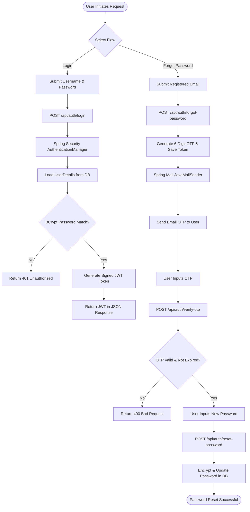
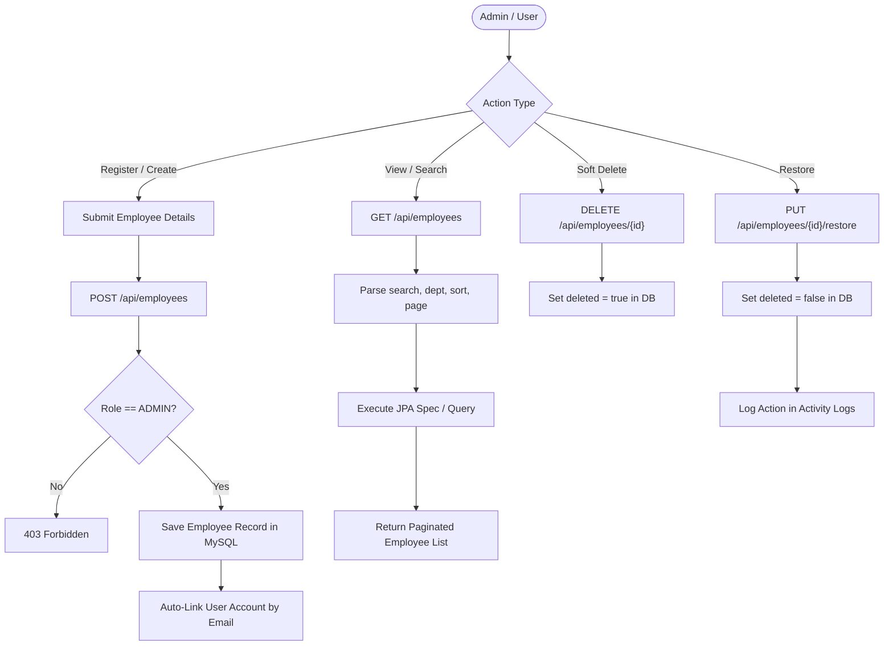
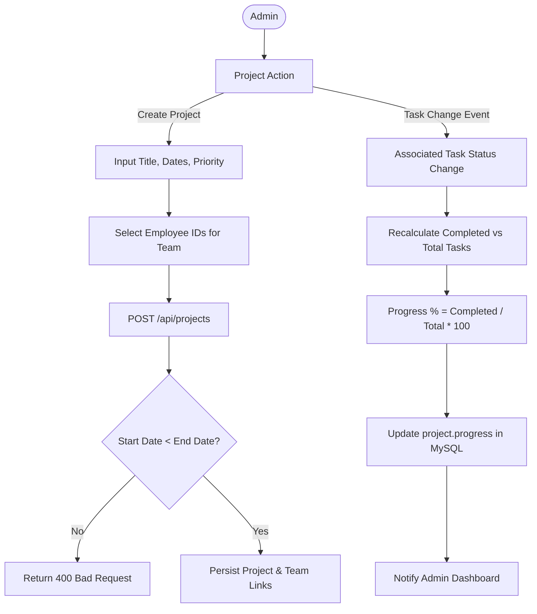
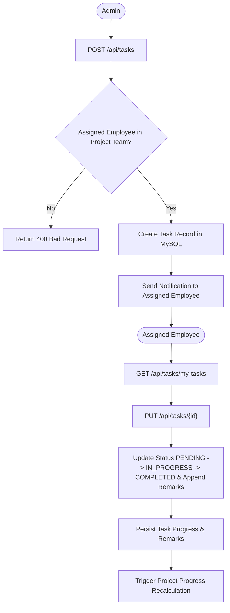
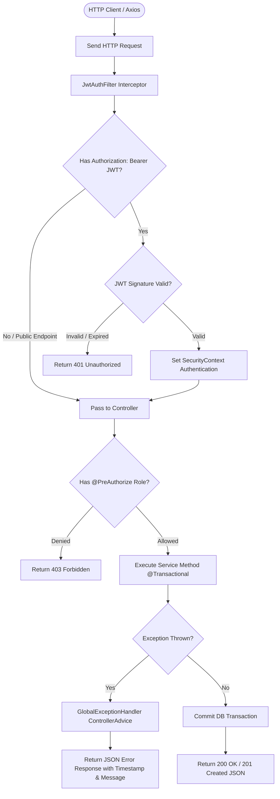
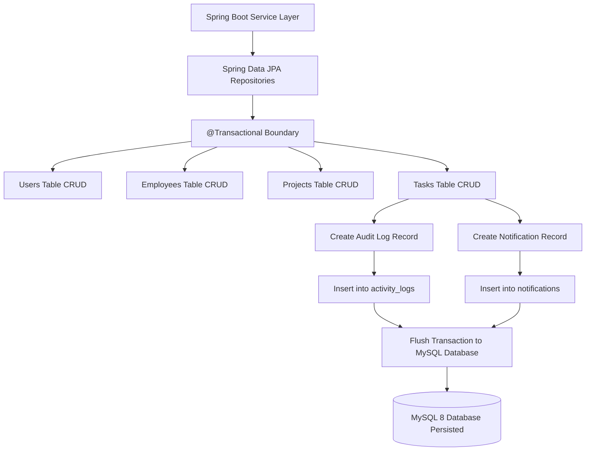

# Smart Employee & Project Management System

A full-stack web application for managing employees, projects, and tasks with secure role-based access control (Admin / Employee). The backend is built using **Spring Boot**, **Spring Security (JWT)**, and **MySQL**, while the frontend uses **React**, **Material UI**, and **Axios**.

---

## Overview

This application helps organizations manage employees, projects, and daily tasks from a single platform. Administrators can manage employees, assign projects and tasks, monitor progress, generate reports, and view activity logs. Employees have access only to the projects and tasks assigned to them.

The application includes secure JWT authentication, email OTP-based password reset, dark mode, dashboard analytics, notifications, reporting, and activity tracking.

## Tech Stack

| Layer | Technology / Library | Purpose |
|-------|----------------------|---------|
| Frontend Framework | React 18 | Builds the Single Page Application (SPA) user interface |
| UI & Styling | Material UI (MUI), Emotion | Responsive UI components with dark/light theme support |
| Routing & API Communication | React Router v6, Axios | Client-side routing and REST API communication with JWT authentication |
| Backend Framework | Java 17, Spring Boot 3.2 | RESTful backend application framework |
| Security & Authentication | Spring Security, JWT | Secure authentication and Role-Based Access Control (RBAC) |
| Persistence & ORM | Spring Data JPA, Hibernate | Database interaction and object-relational mapping |
| Database | MySQL 8 | Relational database management system |
| Email Service | Spring Mail (JavaMailSender) | OTP-based password reset and email notifications |
| Reports | Apache POI, iText7 | Excel and PDF report generation |
| API Documentation | Springdoc OpenAPI (Swagger UI) | Interactive REST API documentation and testing |
| Build Tools | Maven, npm | Dependency management, build automation, and package management |

## Screenshots

- Admin dashboard:
	
          Fig 1: Admin Dashboard & Analytics Overview

- Admin - Employees:
	
          Fig 2: Employee Management Interface

- Admin - Projects:
	
          Fig 3: Project Management & Dynamic Progress Tracking

- Admin - Tasks:
	
          Fig 4: Task Allocation & Progress Tracking Interface
    
- Admin - Reports:
	
          Fig 5: Operational Reports & Multi-Format Download Center

- Activity Log:
	
          Fig 6: System Activity Log & Audit Trail

- Employee view:
	
          Fig 7: Employee Personal Workspace & Dashboard

- Login portal:
	
          Fig 8: User Login & Authentication Portal

- Signup portal:
	
          Fig 9: Account Registration & Role Selection Portal

- Architecture flowchart:
	
          Fig 10: High-Level System Architecture Diagram

- Database ER diagram:
	
          Fig 11: Database Entity-Relationship (ER) Diagram


## Features

### Authentication & Security
* [x] **JWT-based Login and Registration**: Stateless authentication with JWT tokens.
* [x] **BCrypt Password Encryption**: Secure password hashing before persistence.
* [x] **Role-based Authorization**: Fine-grained access control for ADMIN and EMPLOYEE roles.
* [x] **OTP-based Forgot Password**: Email OTP generation and verification flow using JavaMailSender.
* [x] **Global Exception Handling**: Structured REST exception responses across endpoints.
* [x] **Input Validation**: Payload validation and constraint checks.

### Employee Management
* [x] **Employee Operations**: Create, update, delete, and restore employees.
* [x] **Search, Sorting & Pagination**: Query handling across employee lists.
* [x] **Automatic Account Linking**: Automatic Employee creation/linking during user registration using email.
* [x] **Soft Delete Support**: Flag-based deletion with restore functionality.

### Project Management
* [x] **Project Operations**: Create and manage project lifecycles.
* [x] **Team Assignment**: Assign employees to projects.
* [x] **Status & Priority**: Track project progress, status, and priority levels.
* [x] **Deadline Tracking**: Start and end date management.
* [x] **Automatic Progress Calculation**: Project progress automatically updated based on completed tasks.
* [x] **Soft Delete & Restore**: Soft delete support with restoration.

### Task Management
* [x] **Task Operations**: Create, assign, and manage daily tasks.
* [x] **Progress & Status Updates**: Track task progress, status transitions, and add remarks.
* [x] **Soft Delete & Restore**: Recover soft-deleted tasks.
* [x] **Automatic Notifications**: Task notifications generated on assignment/updates.

### Dashboards & User Interface
* [x] **Admin Dashboard Counters**: Total Employees, Total Projects, Total Tasks, Active Projects, Completed Projects, Pending Tasks, Completed Tasks.
* [x] **Employee Dashboard**: Assigned Tasks, Completed Tasks, Upcoming Deadlines, Personal task overview.
* [x] **Additional Features**: In-app notifications with unread badge, Activity Log (Admin only), Dark Mode (stored in LocalStorage), Swagger API Documentation, Excel & PDF Reports (Apache POI & iText7), Responsive UI, Toast Notifications, Loading states, and error handling.

---

## Role-Based Access Control (RBAC) Matrix

| Feature / Permission | Admin (`ADMIN`) | Employee (`EMPLOYEE`) | Server-Side Guard |
| :--- | :---: | :---: | :---: |
| **Manage Employees (Create, Update, Delete)** | ✅ | ❌ | Server-enforced role check |
| **Restore Deleted Records** | ✅ | ❌ | Server-enforced role check |
| **Manage Projects & Assign Teams** | ✅ | ❌ | Server-enforced role check |
| **Create & Assign Tasks** | ✅ | ❌ | Server-enforced role check |
| **View Activity Logs** | ✅ | ❌ | Server-enforced role check |
| **View Reports (Excel / PDF)** | ✅ | ❌ | Server-enforced role check |
| **View Assigned Projects** | ✅ | ✅ *(Assigned Only)* | Server-enforced filtering |
| **View Assigned Tasks** | ✅ | ✅ *(Assigned Only)* | Server-enforced filtering |
| **Update Task Progress & Remarks** | ✅ | ✅ | Server-enforced ownership |
| **View Personal Dashboard** | ✅ | ✅ | Server-enforced role check |
| **Reset Password (OTP)** | ✅ | ✅ | Public / Authenticated |

> **Note**: The backend strictly enforces role-based access. Employees can only access data assigned to them. This restriction is implemented server-side and cannot be bypassed from the frontend.

---

## API Overview & Endpoints Breakdown

All protected endpoints require `Authorization: Bearer <JWT_TOKEN>`.

### Authentication & Security Domain
| Method | Endpoint | Required Role | Description |
| :--- | :--- | :--- | :--- |
| `POST` | `/api/auth/login` | Public | Authenticate user credentials and return JWT token |
| `POST` | `/api/auth/register` | Public | Register new user account with employee linking |
| `POST` | `/api/auth/forgot-password` | Public | Request OTP email for password reset |
| `POST` | `/api/auth/verify-otp` | Public | Verify sent OTP code |
| `POST` | `/api/auth/reset-password` | Public | Set new password with verified OTP |

### Employee Management Domain
| Method | Endpoint | Required Role | Description |
| :--- | :--- | :--- | :--- |
| `GET` | `/api/employees` | Admin / Employee | Search, sort, and fetch paginated employees |
| `POST` | `/api/employees` | Admin | Create a new employee record |
| `PUT` | `/api/employees/{id}` | Admin | Update employee details |
| `DELETE` | `/api/employees/{id}` | Admin | Soft delete an employee record |
| `PUT` | `/api/employees/{id}/restore` | Admin | Restore a soft-deleted employee record |

### Project Management Domain
| Method | Endpoint | Required Role | Description |
| :--- | :--- | :--- | :--- |
| `GET` | `/api/projects` | Admin / Employee | Fetch projects (Employee sees assigned only) |
| `POST` | `/api/projects` | Admin | Create a new project and assign employees |
| `PUT` | `/api/projects/{id}` | Admin | Update project details, status, or team |
| `DELETE` | `/api/projects/{id}` | Admin | Soft delete a project |
| `PUT` | `/api/projects/{id}/restore` | Admin | Restore a soft-deleted project |

### Task Management Domain
| Method | Endpoint | Required Role | Description |
| :--- | :--- | :--- | :--- |
| `GET` | `/api/tasks` | Admin / Employee | Fetch tasks (Employee sees assigned only) |
| `POST` | `/api/tasks` | Admin | Create and assign a task under a project |
| `PUT` | `/api/tasks/{id}` | Admin / Employee | Update task progress status and add remarks |
| `DELETE` | `/api/tasks/{id}` | Admin | Soft delete a task |
| `PUT` | `/api/tasks/{id}/restore` | Admin | Restore a soft-deleted task |

### Reports & Activity Logs Domain
| Method | Endpoint | Required Role | Description |
| :--- | :--- | :--- | :--- |
| `GET` | `/api/reports/excel` | Admin | Generate and download Excel report via Apache POI |
| `GET` | `/api/reports/pdf` | Admin | Generate and download PDF report via iText7 |
| `GET` | `/api/activity-logs` | Admin | View administrative activity logs |
| `GET` | `/api/notifications` | Admin / Employee | Fetch in-app notifications |

---

## Project Structure

```text
project/
├── backend/
│   ├── pom.xml
│   └── src/main/java/com/smartepm/
│       ├── config/
│       ├── controller/
│       ├── service/
│       ├── repository/
│       ├── entity/
│       ├── dto/
│       ├── security/
│       └── exception/
│
├── frontend/
│   └── src/
│       ├── components/
│       ├── pages/
│       ├── services/
│       ├── context/
│       └── routes/
│
├── database/
├── postman/
└── docs/
```

---

## Prerequisites & Setup Instructions

### Prerequisites
Before running the project, make sure the following are installed:
* **Java**: 25
* **Maven**: 3.8+
* **Node.js**: 18+
* **npm**
* **MySQL**: 8+
* **Gmail Account** (or another SMTP provider) for OTP emails

---

### Database Setup

1. Create a MySQL database:
   ```sql
   CREATE DATABASE smart_epm_db;
   ```
2. Hibernate uses `ddl-auto=update`, so all required tables are created automatically when the application starts.
3. The `database/schema.sql` file is included only as a reference.

---

### Backend Setup

1. Move into the backend directory:
   ```bash
   cd backend
   ```

2. Update the database and email configuration inside:
   `src/main/resources/application.properties`

3. 🔐 **Environment Configuration**:
   Sensitive information like database credentials and email passwords are not included in this repository.

   Update `backend/src/main/resources/application.properties` with your own values:

   ```properties
   spring.datasource.url=jdbc:mysql://localhost:3306/smart_epm_db
   spring.datasource.username=your-username
   spring.datasource.password=your-password

   spring.mail.username=your-email@gmail.com
   spring.mail.password=your-app-password
   ```
   > ⚠️ **Warning**: Do not upload real credentials to GitHub.

4. **Configure Email**:
   Add your email credentials:
   ```properties
   spring.mail.username=your-email@gmail.com
   spring.mail.password=your-16-character-app-password
   ```
   * For Gmail, enable Two-Factor Authentication and generate an App Password.
   * If email is not configured, the Forgot Password feature will not send OTP emails, but the remaining application will continue to work normally.

5. **Run the Backend**:
   ```bash
   mvn clean install
   mvn spring-boot:run
   ```
   The backend runs at: [http://localhost:8080](http://localhost:8080)

6. A default administrator account is automatically created:
   * **Username**: `admin`
   * **Password**: `Admin@123`

---

### Frontend Setup

1. Navigate to the frontend directory:
   ```bash
   cd frontend
   ```

2. Install dependencies and start:
   ```bash
   npm install
   npm start
   ```

3. The React application runs at: [http://localhost:3000](http://localhost:3000)

---

## Using the Application

### Admin
* Login using:
  * **Username**: `admin`
  * **Password**: `Admin@123`
* The administrator can manage employees, projects, tasks, reports, notifications, and activity logs.

### Employee
* Register a new account with the **EMPLOYEE** role.
* Employee records are automatically linked (or created) using the registration email.
* Employees only have access to projects and tasks assigned to them.
* If no assignments exist, the application displays a friendly message instead of showing empty tables.

### Forgot Password Flow
1. Click **Forgot Password** on the login page.
2. Enter your email.
3. Receive OTP via email.
4. Verify OTP.
5. Set a new password.

---

## API Documentation (Swagger UI)

Interactive REST API documentation is available via Swagger UI:
* **Swagger UI**: [http://localhost:8080/swagger-ui.html](http://localhost:8080/swagger-ui.html)
* Additional documentation is available inside the `docs` folder.


## Technical Flowcharts & System Diagrams

### 1. Authentication & Security Flowchart
Visualizes the stateless JWT login lifecycle, password hashing via BCrypt, token validation filter, and Email OTP password reset flow.



---

### 2. Employee Management Flowchart
Illustrates the employee record creation, search/sorting, soft deletion, and restoration workflow.



---

### 3. Project Management Flowchart
Shows project creation, Many-to-Many employee team assignment, and automatic progress percentage updates.



---

### 4. Task Management & Progress Flowchart
Maps out task assignment to team members, employee status updates with remarks, and soft delete restoration.



---

### 5. API Request Lifecycle & Error Handling Flowchart
Demonstrates incoming REST API request validation, JWT header filter checks, service layer processing, transaction boundaries, and global exception handling.



---

### 6. Database Persistence & Event Flowchart
Visualizes data interaction between Hibernate JPA, MySQL relational tables, audit trail triggers, and notification records.



---

## Database Script (SQL DDL & Seed DML)

This script creates the database schema for `smart_epm_db` and populates initial default seed data.

```sql
-- ====================================================================
-- SMART EMPLOYEE & PROJECT MANAGEMENT SYSTEM - DATABASE SCRIPT
-- Database: smart_epm_db
-- Engine: MySQL 8.0+
-- ====================================================================

CREATE DATABASE IF NOT EXISTS smart_epm_db;
USE smart_epm_db;

-- 1. USERS TABLE
CREATE TABLE IF NOT EXISTS users (
    id BIGINT AUTO_INCREMENT PRIMARY KEY,
    username VARCHAR(50) NOT NULL UNIQUE,
    email VARCHAR(100) NOT NULL UNIQUE,
    password VARCHAR(255) NOT NULL,
    role VARCHAR(20) NOT NULL DEFAULT 'EMPLOYEE',
    enabled BOOLEAN NOT NULL DEFAULT TRUE,
    deleted BOOLEAN NOT NULL DEFAULT FALSE,
    created_at TIMESTAMP DEFAULT CURRENT_TIMESTAMP,
    updated_at TIMESTAMP DEFAULT CURRENT_TIMESTAMP ON UPDATE CURRENT_TIMESTAMP
);

-- 2. EMPLOYEES TABLE
CREATE TABLE IF NOT EXISTS employees (
    id BIGINT AUTO_INCREMENT PRIMARY KEY,
    user_id BIGINT UNIQUE,
    employee_code VARCHAR(20) UNIQUE,
    first_name VARCHAR(50) NOT NULL,
    last_name VARCHAR(50) NOT NULL,
    email VARCHAR(100) NOT NULL UNIQUE,
    phone VARCHAR(20),
    department VARCHAR(50),
    designation VARCHAR(50),
    hire_date DATE,
    salary DOUBLE,
    status VARCHAR(20) DEFAULT 'ACTIVE',
    deleted BOOLEAN NOT NULL DEFAULT FALSE,
    created_at TIMESTAMP DEFAULT CURRENT_TIMESTAMP,
    updated_at TIMESTAMP DEFAULT CURRENT_TIMESTAMP ON UPDATE CURRENT_TIMESTAMP,
    CONSTRAINT fk_employee_user FOREIGN KEY (user_id) REFERENCES users(id) ON DELETE SET NULL
);

-- 3. PROJECTS TABLE
CREATE TABLE IF NOT EXISTS projects (
    id BIGINT AUTO_INCREMENT PRIMARY KEY,
    project_code VARCHAR(20) UNIQUE,
    name VARCHAR(100) NOT NULL,
    description TEXT,
    status VARCHAR(20) NOT NULL DEFAULT 'ACTIVE',
    priority VARCHAR(20) NOT NULL DEFAULT 'MEDIUM',
    start_date DATE,
    end_date DATE,
    progress DOUBLE DEFAULT 0.0,
    deleted BOOLEAN NOT NULL DEFAULT FALSE,
    created_at TIMESTAMP DEFAULT CURRENT_TIMESTAMP,
    updated_at TIMESTAMP DEFAULT CURRENT_TIMESTAMP ON UPDATE CURRENT_TIMESTAMP
);

-- 4. PROJECT_EMPLOYEES (JOIN TABLE FOR N:M TEAM ASSIGNMENT)
CREATE TABLE IF NOT EXISTS project_employees (
    project_id BIGINT NOT NULL,
    employee_id BIGINT NOT NULL,
    assigned_date DATE DEFAULT (CURRENT_DATE),
    deleted BOOLEAN NOT NULL DEFAULT FALSE,
    PRIMARY KEY (project_id, employee_id),
    CONSTRAINT fk_pe_project FOREIGN KEY (project_id) REFERENCES projects(id) ON DELETE CASCADE,
    CONSTRAINT fk_pe_employee FOREIGN KEY (employee_id) REFERENCES employees(id) ON DELETE CASCADE
);

-- 5. TASKS TABLE
CREATE TABLE IF NOT EXISTS tasks (
    id BIGINT AUTO_INCREMENT PRIMARY KEY,
    project_id BIGINT NOT NULL,
    assigned_to BIGINT,
    title VARCHAR(100) NOT NULL,
    description TEXT,
    status VARCHAR(20) NOT NULL DEFAULT 'PENDING',
    priority VARCHAR(20) NOT NULL DEFAULT 'MEDIUM',
    due_date DATE,
    progress INT DEFAULT 0,
    remarks TEXT,
    deleted BOOLEAN NOT NULL DEFAULT FALSE,
    created_at TIMESTAMP DEFAULT CURRENT_TIMESTAMP,
    updated_at TIMESTAMP DEFAULT CURRENT_TIMESTAMP ON UPDATE CURRENT_TIMESTAMP,
    CONSTRAINT fk_task_project FOREIGN KEY (project_id) REFERENCES projects(id) ON DELETE CASCADE,
    CONSTRAINT fk_task_employee FOREIGN KEY (assigned_to) REFERENCES employees(id) ON DELETE SET NULL
);

-- 6. NOTIFICATIONS TABLE
CREATE TABLE IF NOT EXISTS notifications (
    id BIGINT AUTO_INCREMENT PRIMARY KEY,
    user_id BIGINT NOT NULL,
    title VARCHAR(100) NOT NULL,
    message TEXT NOT NULL,
    is_read BOOLEAN NOT NULL DEFAULT FALSE,
    created_at TIMESTAMP DEFAULT CURRENT_TIMESTAMP,
    CONSTRAINT fk_notification_user FOREIGN KEY (user_id) REFERENCES users(id) ON DELETE CASCADE
);

-- 7. ACTIVITY LOGS TABLE
CREATE TABLE IF NOT EXISTS activity_logs (
    id BIGINT AUTO_INCREMENT PRIMARY KEY,
    user_id BIGINT,
    actor VARCHAR(50) NOT NULL,
    action VARCHAR(50) NOT NULL,
    entity VARCHAR(50) NOT NULL,
    entity_id BIGINT,
    details TEXT,
    timestamp TIMESTAMP DEFAULT CURRENT_TIMESTAMP
);

-- 8. PASSWORD RESET TOKENS TABLE (OTP)
CREATE TABLE IF NOT EXISTS password_reset_tokens (
    id BIGINT AUTO_INCREMENT PRIMARY KEY,
    user_id BIGINT NOT NULL,
    token VARCHAR(10) NOT NULL,
    expiry_date TIMESTAMP NOT NULL,
    used BOOLEAN NOT NULL DEFAULT FALSE,
    created_at TIMESTAMP DEFAULT CURRENT_TIMESTAMP,
    CONSTRAINT fk_token_user FOREIGN KEY (user_id) REFERENCES users(id) ON DELETE CASCADE
);

-- ====================================================================
-- DEFAULT SEED DATA (DML INSERTS)
-- Default Admin Account: admin / Admin@123
-- Password BCrypt Hash: $2a$10$e8w.p4eDkXg8j/2r9f3LceY8rS8zJ5O0e/5qX9y7Z.1K4.YKG
-- ====================================================================

INSERT INTO users (id, username, email, password, role, enabled, deleted) VALUES 
(1, 'admin', 'admin@smartepm.com', '$2a$10$e8w.p4eDkXg8j/2r9f3LceY8rS8zJ5O0e/5qX9y7Z.1K4.YKG', 'ADMIN', TRUE, FALSE),
(2, 'Narendraa', 'narendra12@gmail.com', '$2a$10$e8w.p4eDkXg8j/2r9f3LceY8rS8zJ5O0e/5qX9y7Z.1K4.YKG', 'EMPLOYEE', TRUE, FALSE),
(3, 'Arjun', 'arjun1@gmail.com', '$2a$10$e8w.p4eDkXg8j/2r9f3LceY8rS8zJ5O0e/5qX9y7Z.1K4.YKG', 'EMPLOYEE', TRUE, FALSE);

INSERT INTO employees (id, user_id, employee_code, first_name, last_name, email, phone, department, designation, status, deleted) VALUES
(1, 2, 'EMP-001', 'Narendraa', 'Kumar', 'narendra12@gmail.com', '9876543210', 'Engineering', 'Software Engineer', 'ACTIVE', FALSE),
(2, 3, 'EMP-002', 'Arjun', 'Verma', 'arjun1@gmail.com', '9876543211', 'Engineering', 'Full Stack Developer', 'ACTIVE', FALSE);

INSERT INTO projects (id, project_code, name, description, status, priority, start_date, end_date, progress, deleted) VALUES
(1, 'PRJ-101', 'AI-Chatbot', 'Enterprise customer support chatbot module.', 'COMPLETED', 'HIGH', '2026-06-01', '2026-07-31', 100.0, FALSE),
(2, 'PRJ-102', 'AI-HR-Leave Analyzer', 'Automated leave analysis and tracking module.', 'ACTIVE', 'HIGH', '2026-07-01', '2026-08-20', 70.0, FALSE);

INSERT INTO project_employees (project_id, employee_id) VALUES 
(1, 1), 
(2, 2);

INSERT INTO tasks (id, project_id, assigned_to, title, description, status, priority, due_date, progress, remarks, deleted) VALUES
(1, 1, 1, 'UI design', 'Design chatbot frontend UI components.', 'COMPLETED', 'HIGH', '2026-07-15', 100, 'UI components delivered', FALSE),
(2, 2, 2, 'Testing', 'Write unit and integration tests for leave analyzer.', 'IN_PROGRESS', 'HIGH', '2026-07-31', 70, 'Testing in progress', FALSE);
```

---

## Postman Collection Integration

A pre-configured Postman collection is provided in the repository to test and verify all backend REST endpoints.

* **Collection File Location**: `postman/Smart-EPM.postman_collection.json`

### 1. Import Collection
1. Open **Postman**.
2. Click **Import** in the top left corner.
3. Select `postman/Smart-EPM.postman_collection.json`.

### 2. Configure Collection Environment Variables
Set the following environment or collection variables in Postman:

| Variable Name | Initial Value | Current Value | Description |
| :--- | :--- | :--- | :--- |
| `baseUrl` | `http://localhost:8080` | `http://localhost:8080` | Backend API base URL |
| `token` | *(Leave Empty)* | *(Auto-Populated)* | JWT Authentication Token |

### 3. Automated Token Capture Script
The collection includes a **Tests script** under `POST /api/auth/login` that automatically captures and stores the returned JWT token into the `token` variable:

```javascript
// Postman Post-Response Script (Tests tab of POST /api/auth/login)
if (pm.response.code === 200) {
    var responseJson = pm.response.json();
    if (responseJson.token) {
        pm.collectionVariables.set("token", responseJson.token);
        console.log("JWT Token captured and saved to collection variables.");
    }
}
```

### 4. Executing Protected Requests
All subsequent requests in the collection (*Employees, Projects, Tasks, Reports, Activity Logs*) automatically include the following header:

```text
Authorization: Bearer {{token}}
```


---

