# Smart Employee & Project Management System

A full-stack web application for managing employees, projects, and tasks with secure role-based access control (Admin / Employee). The backend is built using **Spring Boot**, **Spring Security (JWT)**, and **MySQL**, while the frontend uses **React**, **Material UI**, and **Axios**.

---

## Overview

This application helps organizations manage employees, projects, and daily tasks from a single platform. Administrators can manage employees, assign projects and tasks, monitor progress, generate reports, and view activity logs. Employees have access only to the projects and tasks assigned to them.

The application includes secure JWT authentication, email OTP-based password reset, dark mode, dashboard analytics, notifications, reporting, and activity tracking.

## Tech Stack

| Layer | Technology / Library | Purpose |
|-------|----------------------|---------|
| Frontend Framework | React 18 | Builds the Single Page Application (SPA) user interface |
| UI & Styling | Material UI (MUI), Emotion | Responsive UI components with dark/light theme support |
| Routing & API Communication | React Router v6, Axios | Client-side routing and REST API communication with JWT authentication |
| Backend Framework | Java 17, Spring Boot 3.2 | RESTful backend application framework |
| Security & Authentication | Spring Security, JWT | Secure authentication and Role-Based Access Control (RBAC) |
| Persistence & ORM | Spring Data JPA, Hibernate | Database interaction and object-relational mapping |
| Database | MySQL 8 | Relational database management system |
| Email Service | Spring Mail (JavaMailSender) | OTP-based password reset and email notifications |
| Reports | Apache POI, iText7 | Excel and PDF report generation |
| API Documentation | Springdoc OpenAPI (Swagger UI) | Interactive REST API documentation and testing |
| Build Tools | Maven, npm | Dependency management, build automation, and package management |

## Screenshots

- Admin dashboard:
	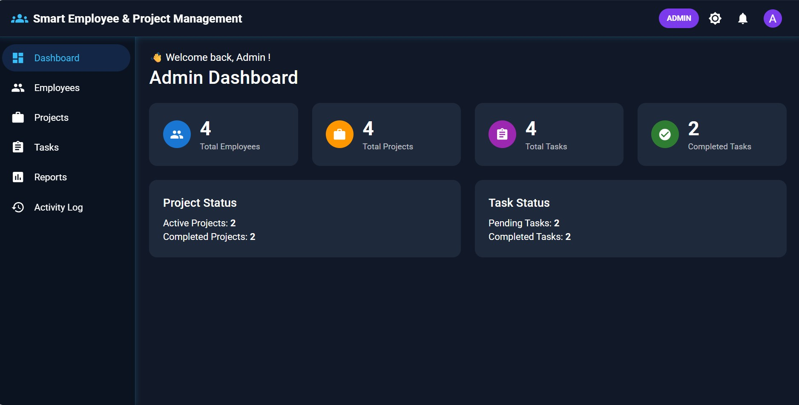

- Admin - Employees:
	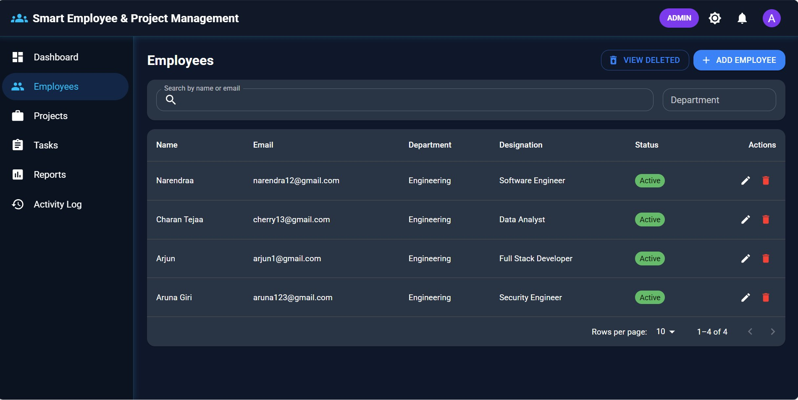

- Admin - Projects:
	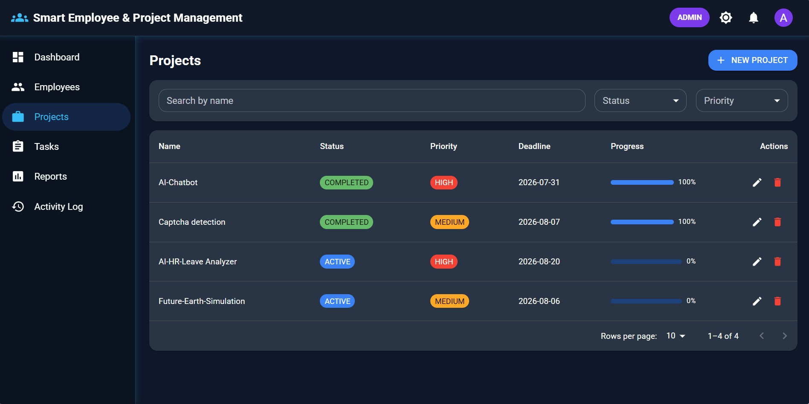

- Admin - Tasks:
	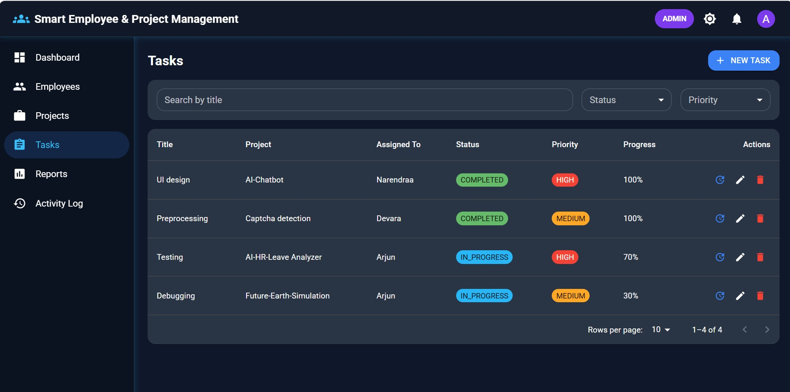

- Admin - Reports:
	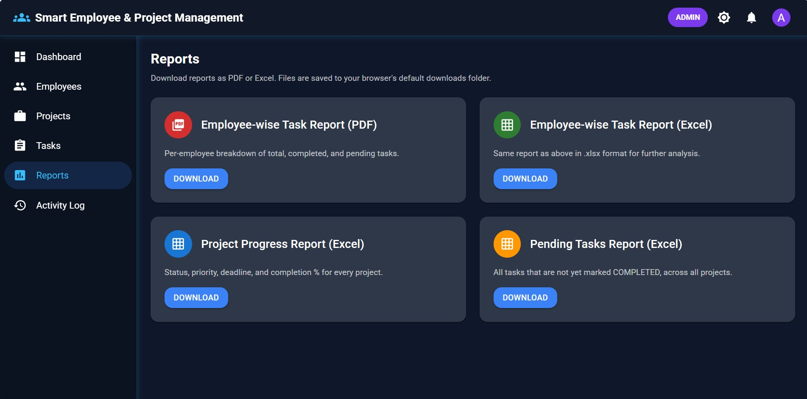

- Activity Log:
	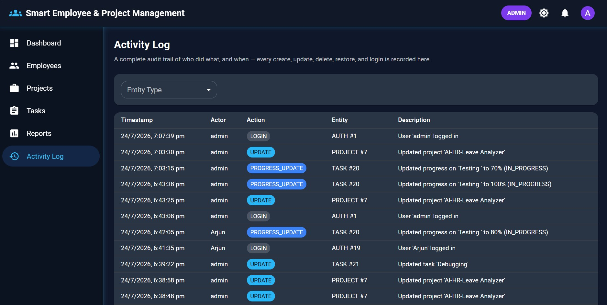

- Employee view:
	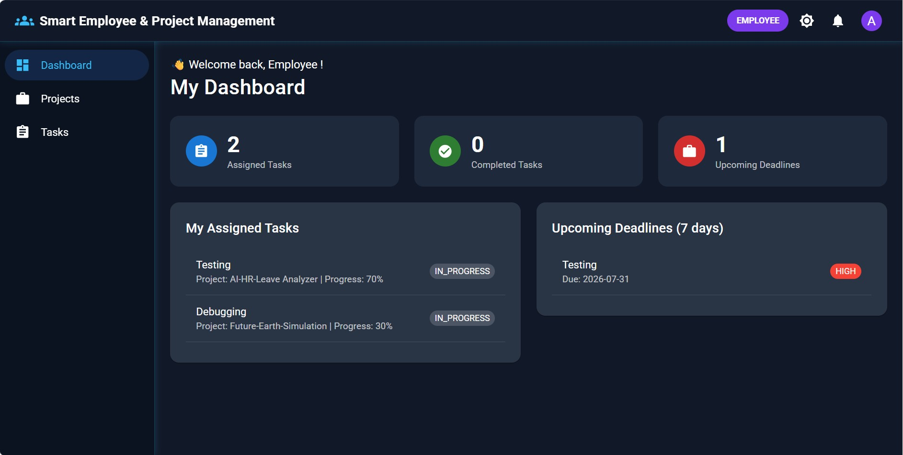

- Login portal:
	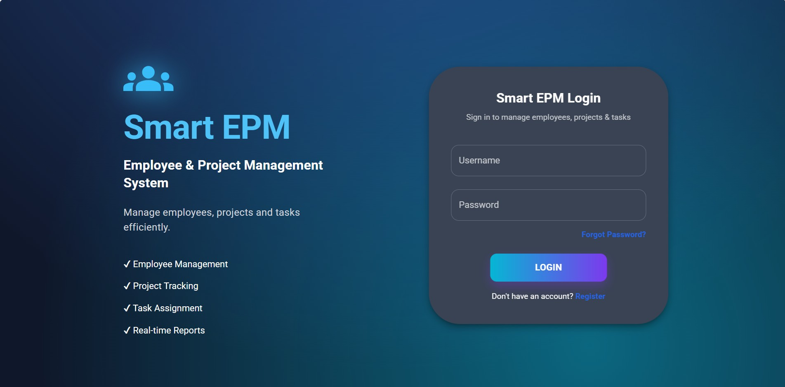

- Signup portal:
	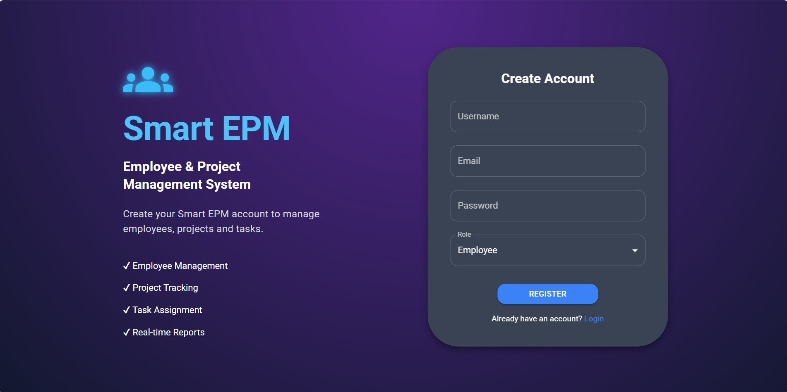

- Architecture flowchart:
	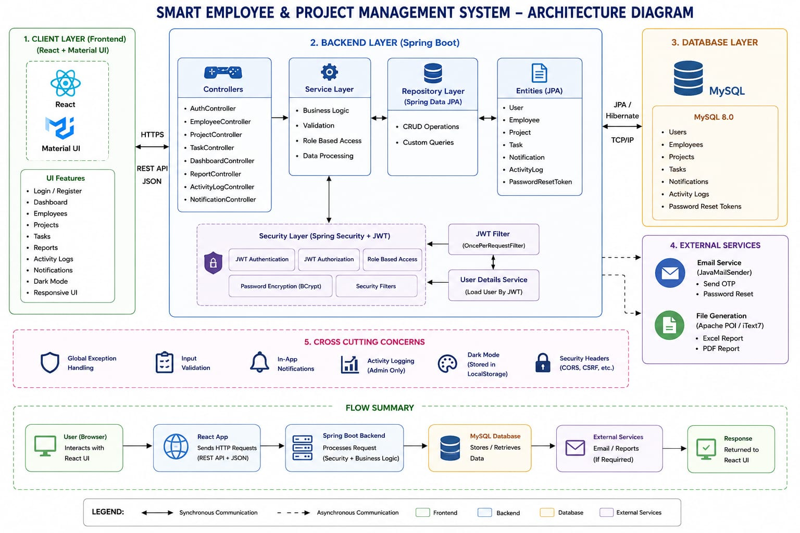

- Database ER diagram:
	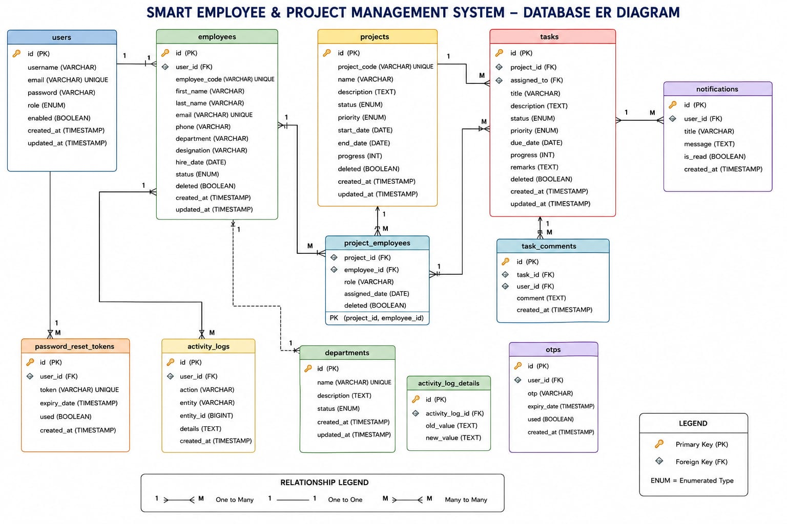

3. Features Checklist & System Capabilities
Authentication & Security
 JWT-based Login and Registration: Stateless authentication with JWT tokens.
 BCrypt Password Encryption: Secure password hashing before persistence.
 Role-based Authorization: Fine-grained access control for ADMIN and EMPLOYEE roles.
 OTP-based Forgot Password: Email OTP generation and verification flow using JavaMailSender.
 Global Exception Handling: Structured REST exception responses across endpoints.
 Input Validation: Payload validation and constraint checks.
Employee Management
 Employee Operations: Create, update, delete, and restore employees.
 Search, Sorting & Pagination: Query handling across employee lists.
 Automatic Account Linking: Automatic Employee creation/linking during user registration using email.
 Soft Delete Support: Flag-based deletion with restore functionality.
Project Management
 Project Operations: Create and manage project lifecycles.
 Team Assignment: Assign employees to projects.
 Status & Priority: Track project progress, status, and priority levels.
 Deadline Tracking: Start and end date management.
 Automatic Progress Calculation: Project progress automatically updated based on completed tasks.
 Soft Delete & Restore: Soft delete support with restoration.
Task Management
 Task Operations: Create, assign, and manage daily tasks.
 Progress & Status Updates: Track task progress, status transitions, and add remarks.
 Soft Delete & Restore: Recover soft-deleted tasks.
 Automatic Notifications: Task notifications generated on assignment/updates.
Dashboards & User Interface
 Admin Dashboard Counters: Total Employees, Total Projects, Total Tasks, Active Projects, Completed Projects, Pending Tasks, Completed Tasks.
 Employee Dashboard: Assigned Tasks, Completed Tasks, Upcoming Deadlines, Personal task overview.
 Additional Features: In-app notifications with unread badge, Activity Log (Admin only), Dark Mode (stored in LocalStorage), Swagger API Documentation, Excel & PDF Reports (Apache POI & iText7), Responsive UI, Toast Notifications, Loading states, and error handling.
4. Role-Based Access Control (RBAC) Matrix
Feature / Permission	Admin (ADMIN)	Employee (EMPLOYEE)	Server-Side Guard
Manage Employees (Create, Update, Delete)	✅	❌	Server-enforced role check
Restore Deleted Records	✅	❌	Server-enforced role check
Manage Projects & Assign Teams	✅	❌	Server-enforced role check
Create & Assign Tasks	✅	❌	Server-enforced role check
View Activity Logs	✅	❌	Server-enforced role check
View Reports (Excel / PDF)	✅	❌	Server-enforced role check
View Assigned Projects	✅	✅ (Assigned Only)	Server-enforced filtering
View Assigned Tasks	✅	✅ (Assigned Only)	Server-enforced filtering
Update Task Progress & Remarks	✅	✅	Server-enforced ownership
View Personal Dashboard	✅	✅	Server-enforced role check
Reset Password (OTP)	✅	✅	Public / Authenticated
Note: The backend strictly enforces role-based access. Employees can only access data assigned to them. This restriction is implemented server-side and cannot be bypassed from the frontend.

5. API Overview & Endpoints Breakdown
All protected endpoints require Authorization: Bearer <JWT_TOKEN>.

5.1 Authentication & Security Domain
Method	Endpoint	Required Role	Description
POST	/api/auth/login	Public	Authenticate user credentials and return JWT token
POST	/api/auth/register	Public	Register new user account with employee linking
POST	/api/auth/forgot-password	Public	Request OTP email for password reset
POST	/api/auth/verify-otp	Public	Verify sent OTP code
POST	/api/auth/reset-password	Public	Set new password with verified OTP
5.2 Employee Management Domain
Method	Endpoint	Required Role	Description
GET	/api/employees	Admin / Employee	Search, sort, and fetch paginated employees
POST	/api/employees	Admin	Create a new employee record
PUT	/api/employees/{id}	Admin	Update employee details
DELETE	/api/employees/{id}	Admin	Soft delete an employee record
PUT	/api/employees/{id}/restore	Admin	Restore a soft-deleted employee record
5.3 Project Management Domain
Method	Endpoint	Required Role	Description
GET	/api/projects	Admin / Employee	Fetch projects (Employee sees assigned only)
POST	/api/projects	Admin	Create a new project and assign employees
PUT	/api/projects/{id}	Admin	Update project details, status, or team
DELETE	/api/projects/{id}	Admin	Soft delete a project
PUT	/api/projects/{id}/restore	Admin	Restore a soft-deleted project
5.4 Task Management Domain
Method	Endpoint	Required Role	Description
GET	/api/tasks	Admin / Employee	Fetch tasks (Employee sees assigned only)
POST	/api/tasks	Admin	Create and assign a task under a project
PUT	/api/tasks/{id}	Admin / Employee	Update task progress status and add remarks
DELETE	/api/tasks/{id}	Admin	Soft delete a task
PUT	/api/tasks/{id}/restore	Admin	Restore a soft-deleted task
5.5 Reports & Activity Logs Domain
Method	Endpoint	Required Role	Description
GET	/api/reports/excel	Admin	Generate and download Excel report via Apache POI
GET	/api/reports/pdf	Admin	Generate and download PDF report via iText7
GET	/api/activity-logs	Admin	View administrative activity logs
GET	/api/notifications	Admin / Employee	Fetch in-app notifications
6. Project Structure
text

project/
├── backend/
│   ├── pom.xml
│   └── src/main/java/com/smartepm/
│       ├── config/
│       ├── controller/
│       ├── service/
│       ├── repository/
│       ├── entity/
│       ├── dto/
│       ├── security/
│       └── exception/
│
├── frontend/
│   └── src/
│       ├── components/
│       ├── pages/
│       ├── services/
│       ├── context/
│       └── routes/
│
├── database/
├── postman/
└── docs/
7. Prerequisites & Setup Instructions
7.1 Prerequisites
Before running the project, make sure the following are installed:

Java: 17 or later
Maven: 3.8+
Node.js: 18+
npm
MySQL: 8+
Gmail Account (or another SMTP provider) for OTP emails
7.2 Database Setup
Create a MySQL database:
sql

CREATE DATABASE smart_epm_db;
Hibernate uses ddl-auto=update, so all required tables are created automatically when the application starts.
The database/schema.sql file is included only as a reference.
7.3 Backend Setup
Move into the backend directory:

bash

cd backend
Update the database and email configuration inside: src/main/resources/application.properties

🔐 Environment Configuration: Sensitive information like database credentials and email passwords are not included in this repository.

Update backend/src/main/resources/application.properties with your own values:

properties

spring.datasource.url=jdbc:mysql://localhost:3306/smart_epm_db
spring.datasource.username=your-username
spring.datasource.password=your-password
spring.mail.username=your-email@gmail.com
spring.mail.password=your-app-password
⚠️ Warning: Do not upload real credentials to GitHub.

Configure Email: Add your email credentials:

properties

spring.mail.username=your-email@gmail.com
spring.mail.password=your-16-character-app-password
For Gmail, enable Two-Factor Authentication and generate an App Password.
If email is not configured, the Forgot Password feature will not send OTP emails, but the remaining application will continue to work normally.
Run the Backend:

bash

mvn clean install
mvn spring-boot:run
The backend runs at: http://localhost:8080

A default administrator account is automatically created:

Username: admin
Password: Admin@123
7.4 Frontend Setup
Navigate to the frontend directory:

bash

cd frontend
Install dependencies and start:

bash

npm install
npm start
The React application runs at: http://localhost:3000

8. Using the Application
Admin
Login using:
Username: admin
Password: Admin@123
The administrator can manage employees, projects, tasks, reports, notifications, and activity logs.
Employee
Register a new account with the EMPLOYEE role.
Employee records are automatically linked (or created) using the registration email.
Employees only have access to projects and tasks assigned to them.
If no assignments exist, the application displays a friendly message instead of showing empty tables.
Forgot Password Flow
Click Forgot Password on the login page.
Enter your email.
Receive OTP via email.
Verify OTP.
Set a new password.
9. API Documentation (Swagger UI)
Interactive REST API documentation is available via Swagger UI:

Swagger UI: http://localhost:8080/swagger-ui.html
Additional documentation is available inside the docs folder.
10. Postman Collection
Import the pre-configured Postman collection file:

Path: postman/Smart-EPM.postman_collection.json
Set the following collection variables:

baseUrl: http://localhost:8080
token: (JWT authentication bearer token)

